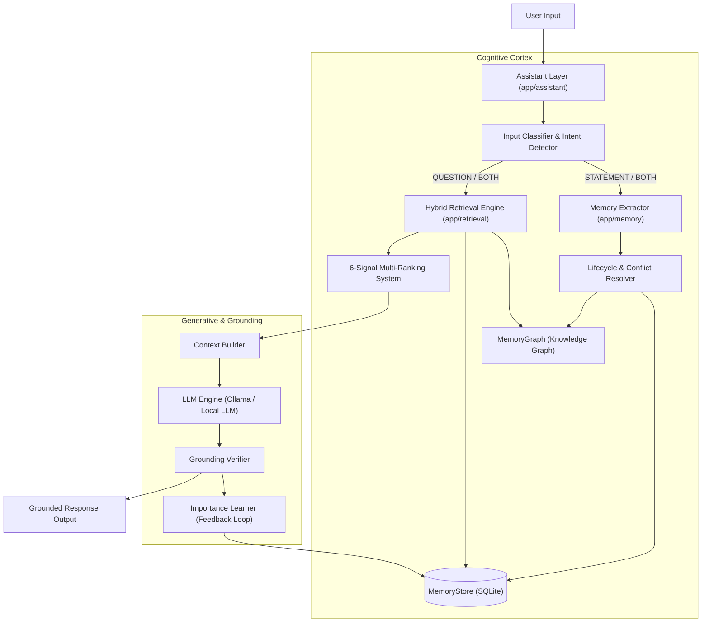

# Project Recallix — System Architecture 🏛️

This document details the layered architecture, design principles, and data flow of **Project Recallix**, an enterprise-grade long-term memory system for LLM applications.

---

## 1. Architectural Overview

Project Recallix is architected as an autonomous **cognitive memory cortex** that decouples long-term factual persistence and knowledge graph reasoning from the generative LLM. It is structured into seven distinct, decoupled layers:

---

## 2. Layer-by-Layer Architecture

### Layer 1: Memory & Data Layer (`app/database/`, `app/memory/`)

The Memory Layer is the foundational persistence substrate of Recallix. It stores structured facts, lifecycle states, and dense vector embeddings.

#### 1. Data Models (`app/database/models.py`)
The primary entity is the `Memory` table managed via SQLAlchemy:
- `id` (Integer, Primary Key): Unique memory identifier.
- `subject` (String): The entity (default `"User"`).
- `relation` (String): The relational predicate (e.g. `works_on`, `lives_in`, `knows`).
- `value` (String): The entity or factual statement (e.g. `"Project Recallix"`, `"Mumbai"`).
- `category` (String): Functional domain (`PROJECT`, `LOCATION`, `SKILL`, `EDUCATION`, `GOAL`, `PREFERENCE`, `GENERAL`).
- `importance` (Integer, 1–10): User or system-assigned base importance.
- `active` (Boolean): Soft-delete / lifecycle flag. Active memories participate in retrieval; inactive memories are archived.
- `embedding` (LargeBinary): Serialized 384-dimensional float32 embedding vector (1536 bytes).
- `temporal_state` (String): `PAST`, `PRESENT`, or `FUTURE`.
- `metadata_json` (Text): Structured metadata tracking supersede chains, conflict reasons, restoration logs, and reinforcement history.
- `created_at`, `updated_at`, `last_accessed_at` (DateTime): Timestamps for recency decay and access tracking.

#### 2. Memory Lifecycle Management (`app/memory/lifecycle.py`)
Recallix implements an intelligent memory lifecycle to maintain factual consistency:
- **Conflict Detection**: When a new fact is stored with the same `(subject, relation)` but a different `value`, Recallix compares their temporal states.
  - If both are `PRESENT` facts (e.g. "Lives in Delhi" vs. "Lives in Mumbai"), the old memory is marked `active=False` with status `"superseded"` and linked via `superseded_memory_id`.
  - If temporal states differ (e.g. past location vs. current location), both memories remain `active=True` and coexist peacefully.
- **Restoration Safety**: Archived memories can be restored using `restore_memory()`. If an active conflicting memory exists, restoration requires an explicit overwrite flag to prevent state corruption.
- **Dormancy & Forgetting (`app/memory/forgetting.py`)**:
  - Automatically identifies dormant memories based on time decay (default 30 days without access) and low effective importance.
  - **Protection Rules**: Memories with high reinforcement (helpful count $\ge 3$) or high importance (effective importance $\ge 6.0$) are permanently shielded from automatic forgetting.

---

### Layer 2: Knowledge Graph Layer (`app/memory/graph.py`)

To reason across interconnected facts, Recallix maintains an in-memory directed knowledge graph (`MemoryGraph`).

#### 1. Graph Representation
- **Nodes**: Entities (`User`, `Project Recallix`, `Python`, `Rust`).
- **Edges**: Directed relationships labeled with relations, categories, weights, and source `memory_id` references.

#### 2. Graph Operations
- **Automatic Ingestion**: As memories are saved into `MemoryStore`, corresponding edges are registered in `MemoryGraph`.
- **Multi-Hop Traversal**: Discovers indirect relationships (e.g. `User` $\rightarrow$ `Recallix` $\rightarrow$ `Python` $\rightarrow$ `Data Science`).
- **Graph Proximity Scoring**: Computes normalized proximity scores ($1 / (1 + \text{path\_length})$) between query target entities and candidate memories, allowing semantic search to be boosted by relational relevance.

---

### Layer 3: Embedding Layer (`app/embeddings/embedding_engine.py`)

The Embedding Layer transforms textual facts and user queries into dense vector representations.

- **Model**: `all-MiniLM-L6-v2` (Sentence-Transformers), producing 384-dimensional dense vectors.
- **Memory Formulation**: Memories are formatted before vectorization to emphasize semantic structure:
  $$\text{Text} = \text{"[CATEGORY] Subject Relation Value"}$$
- **Binary Serialization**: Vector arrays (`np.float32`) are serialized to raw bytes via `.tobytes()` for fast SQLite BLOB storage, bypassing JSON parsing overhead.
- **Similarity Metric**: Cosine similarity:
  $$\text{CosineSim}(\mathbf{u}, \mathbf{v}) = \frac{\mathbf{u} \cdot \mathbf{v}}{\|\mathbf{u}\|_2 \|\mathbf{v}\|_2}$$

---

### Layer 4: Retrieval Layer (`app/retrieval/`)

Recallix uses an advanced **6-Signal Hybrid Ranking** algorithm in `AdvancedRetrievalEngine`:

$$\text{FinalScore} = \frac{0.35 S_{\text{sem}} + 0.20 S_{\text{graph}} + 0.15 S_{\text{temp}} + 0.10 S_{\text{intent}} + 0.10 S_{\text{imp}} + 0.10 S_{\text{rec}}}{1.0}$$

Where:
1. **$S_{\text{sem}}$ (Semantic Similarity, 35%)**: Cosine similarity between query embedding and memory embedding, normalized to $[0, 1]$.
2. **$S_{\text{graph}}$ (Graph Proximity, 20%)**: Shortest path proximity in `MemoryGraph` between query entities and memory nodes.
3. **$S_{\text{temp}}$ (Temporal Alignment, 15%)**: Match between query temporal intent (`PAST`, `PRESENT`, `FUTURE`) and memory temporal state.
4. **$S_{\text{intent}}$ (Query Intent Relevance, 10%)**: Direct match between detected intent category and memory category/relation.
5. **$S_{\text{imp}}$ (Learned Importance, 10%)**: Normalized effective importance calculated by `ImportanceLearner`.
6. **$S_{\text{rec}}$ (Recency Decay, 10%)**: Exponential time decay based on last access and update timestamps.

#### Explainability
Every retrieved result includes an explanation payload detailing:
- Individual score component contributions.
- Human-readable reasons ("Direct semantic match", "Active current fact", "Reinforced by previous answers").

---

### Layer 5: Assistant Layer (`app/assistant/assistant_engine.py`)

The Assistant Layer is the top-level orchestration coordinator.

#### 1. Input Classification
User input is classified into one of four operational modes:
- `STATEMENT`: New facts asserted $\rightarrow$ extracted and stored in `MemoryStore` and `MemoryGraph`. LLM generation skipped.
- `QUESTION`: Inquiry $\rightarrow$ triggers hybrid retrieval and grounded generation.
- `BOTH`: Contains both a statement and a question $\rightarrow$ statement is stored first, then relevant memories are retrieved to answer the question.
- `NEITHER`: Conversational greeting or chit-chat $\rightarrow$ direct conversational response without database retrieval.

---

### Layer 6: LLM & Reasoning Layer (`app/llm/llm_engine.py`)

The LLM Layer performs grounded synthesis and hallucination detection.

#### 1. Strict Grounded Prompting
Retrieved memories are formatted into a structured context block. The LLM is instructed:
> "Answer the user question using ONLY the provided memory facts. If the memory context does not contain enough information to answer, you MUST state that you do not have that information. Do not speculate or invent facts."

#### 2. Answer Grounding Verification
After generation, `verify_answer_grounding(response, memories)` validates the output:
- Verifies that key entities in the answer match values in the retrieved memories.
- Computes a `grounding_score` ($0.0 - 1.0$).
- If grounded, triggers positive reinforcement via `ImportanceLearner`.

#### 3. Extractive Fallback
If the local Ollama runtime is offline or unreachable, Recallix automatically engages an **extractive fallback mechanism**, directly returning a clean, synthesized answer from the retrieved facts without crashing.

---

### Layer 7: Production Hardening Layer (`app/config.py`, `app/utils/`)

Provides enterprise reliability, observability, and safety:
- **Centralized Configuration (`app/config.py`)**: `Settings` dataclass loading defaults with `RECALLIX_*` environment variable overrides.
- **Structured Logging (`app/utils/logging.py`)**: Centralized logger emitting JSON formatted events for memory modifications, retrievals, LLM queries, and errors.
- **Latency Tracking (`app/utils/metrics.py`)**: `LatencyTracker` profiling sub-millisecond execution across `memory_ms`, `retrieval_ms`, `llm_ms`, and `total_ms`.
- **Memory Safety & Validators (`app/utils/validators.py`)**:
  - `sanitize_text`: Strips null bytes and control characters.
  - `validate_memory_content`: Enforces non-empty values and length limits.
  - `validate_embedding_vector`: Verifies 384-dimensional byte sizes, detects NaN/Inf, and rejects zero-vectors.
  - `validate_user_query`: Enforces query length limits and rejects blank inputs.
